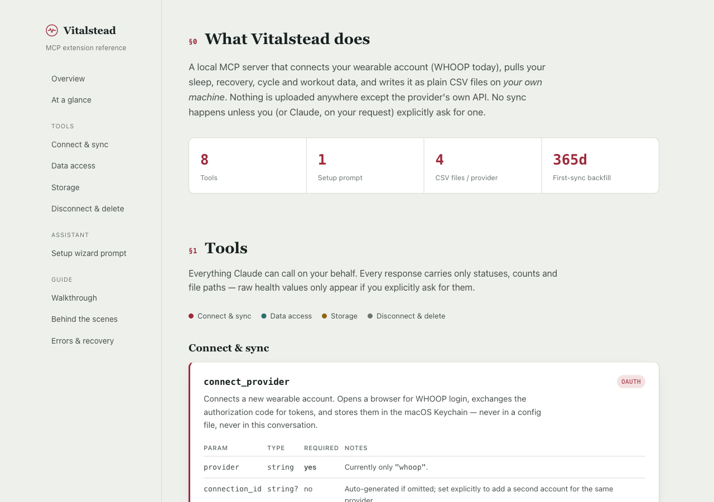

# Vitalstead

**Vitalstead** is a local MCP server + Claude plugin that syncs your wearable
health data (WHOOP today; Oura and Garmin planned) into plain CSV files on
your own machine — and lets Claude read and query them on request. There is
no cloud storage, no telemetry, and no AI embedded in the product: Vitalstead
is a data connector that plugs into your AI client (Claude Desktop / Claude
Code), not the other way around.

- **Local-first.** CSV files live in a folder you choose. Nothing is
  uploaded anywhere except the provider's own OAuth/API endpoints.
- **Sync on demand only.** Data is only fetched when you explicitly ask
  (a tool call), never on a background schedule.
- **You own the OAuth app.** Vitalstead never asks for your provider
  password — you register your own WHOOP developer app (BYO OAuth) and the
  setup wizard walks you through it.
- **Secrets never reach the model.** Client secrets and tokens are entered
  through the plugin's own configuration UI and stored via the OS keychain
  (or the extension's secure config storage) — never typed into chat, never
  returned by a tool.

Vitalstead is a distribution-focused offshoot of the parent **Control Your
Data** project; the Rust core (OAuth state machine, CSV schema/upsert,
platform keychain adapter) is shared between them. See
[`docs/decisions.md`](docs/decisions.md) (start at D-014) for why this
form factor exists, and [`docs/architecture.md`](docs/architecture.md) for
how the core is structured.

## What it can do today

- Connect a WHOOP account via OAuth (`connect_provider`) using your own
  WHOOP developer app credentials.
- Sync sleep, recovery, cycle/strain, and workout data into per-source CSV
  files, including a first-sync history backfill (`sync_now` /
  `sync_provider`).
- List connected sources and inspect what's been synced (`list_data`).
- Ask Claude questions about the data without dumping raw rows into the
  conversation — `query_data` returns aggregates (min/max/avg/count) over
  a metric, and flags any still-open/provisional cycles instead of quietly
  blending them into an average.
- Change where CSVs are written (`set_data_folder`), disconnect a provider
  (`disconnect_provider`, revokes tokens but never deletes your CSVs —
  D-010), or wipe all local app data on request (`delete_app_data`).
- Walk you through first-time setup end to end via a guided MCP prompt
  (`setup_guide` / the `setup-guide` skill): registering a WHOOP developer
  app, choosing a data folder, connecting, and running the first sync.

Provider support is currently WHOOP only; Oura and Garmin (manual ZIP
import) are tracked as post-MVP (D-017/D-018).

## Screenshot

[`docs/reference.html`](docs/reference.html) is a self-contained, browsable
reference of every tool, the setup wizard flow, and error handling — open it
directly in a browser, no build step needed.



## Two ways to install

This repo ships two parallel packaging channels for the same server —
pick whichever fits how you use Claude:

| Channel | What it is | Where |
|---|---|---|
| **Desktop Extension (MCPB)** | One-click install into Claude Desktop | [`mcpb/vitalstead.mcpb`](mcpb/vitalstead.mcpb) |
| **Claude plugin** | Skill + slash commands + MCP server, for Claude Code / Cowork-style plugin installs | [`plugin/`](plugin/), see [`plugin/README.md`](plugin/README.md) |

### Install the Desktop Extension (MCPB)

1. In Claude Desktop: `Settings → Extensions → Install from file...` (or the
   equivalent "install an extension" flow) and select
   [`mcpb/vitalstead.mcpb`](mcpb/vitalstead.mcpb) from this repo.
2. When prompted for extension settings, choose a **Data Storage Folder**.
   You can leave the WHOOP Client ID/Secret blank for now — the setup
   wizard tells you when to come back and fill them in.
3. Ask Claude to *"set up Vitalstead"*, or just start with something like
   *"Connect my WHOOP account and set my data folder to ~/HealthData."*

### Install the Claude plugin

See [`plugin/README.md`](plugin/README.md) for prerequisites (currently
macOS/Apple Silicon for the bundled binary, or build from source for Intel),
install steps via a plugin marketplace, and available slash commands
(`/connect`, `/sync`, `/disconnect`).

## Example prompts

- *"Connect my WHOOP account and set my data folder to ~/HealthData."*
- *"Sync my WHOOP data now and tell me how many nights of sleep got saved."*
- *"What's my average recovery score over the last week from my WHOOP data?"*

## Documentation

- [`docs/decisions.md`](docs/decisions.md) — numbered product decisions
  (start at D-014 for the form-factor choice); the source of truth for
  "why does it work this way."
- [`docs/architecture.md`](docs/architecture.md) — core/platform split,
  module layout.
- [`docs/privacy.md`](docs/privacy.md) — what's stored locally, what's in
  the keychain, what reaches the provider's API, and what (if anything)
  reaches the AI model.
- [`docs/threat-model.md`](docs/threat-model.md) — security assumptions
  and mitigations.
- [`docs/reference.html`](docs/reference.html) — a browsable reference of
  every tool, the setup wizard flow, and error handling; open it directly
  in a browser.
- [`docs/tasks/README.md`](docs/tasks/README.md) — the task backlog
  (epics, T-xxx tasks).
- [`docs/roadmap.md`](docs/roadmap.md) — milestone sequence.

## Roadmap

Milestones are ordered by dependency, not by calendar date — each one
unblocks the next.

| # | Milestone | Status |
|---|---|---|
| M1 | Core ported from the parent Tauri project, platform-independent | ✅ done — 90+ unit tests green |
| M2 | MCP server scaffold (`initialize`, tool listing) | ✅ done |
| M3 | End-to-end OAuth (browser → provider → tokens in Keychain, provider-agnostic) | ✅ done |
| M4 | First sync (`sync_now` fills WHOOP CSVs, atomically) | ✅ done |
| M5 | Connector contract locked (a second provider can be added without core refactors) | ✅ done |
| M6 | Closed MVP (plugin installable by testers from a personal marketplace) | ✅ done |
| M7 | Distribution polish (MCPB one-click bundle) | ✅ done |
| M8 | Public channel — submission to the Anthropic directory | ⬜ not yet submitted |
| — | Oura connector | ⬜ post-MVP |
| — | Garmin (manual ZIP import) | ⬜ post-MVP |
| — | Windows support for the MCPB bundle | ⬜ post-MVP |

## License

MIT — see [`LICENSE`](LICENSE).

## Supporting this project

Vitalstead is a solo, spare-time project. If it's useful to you and you'd
like to help it keep moving, sponsorships go toward two concrete things:

- **Building out more providers.** Oura and Garmin support both require
  actually owning the devices/subscriptions to develop and test against —
  right now that's the main blocker on the roadmap items above.
- **Getting into the public Anthropic directory.** Submission and review
  for Desktop Extensions / the Claude plugin marketplace (M8) has its own
  overhead (test accounts, iteration on reviewer feedback) that sponsorship
  helps cover.

## Development

```sh
cargo test        # 90+ unit tests across the Rust core and MCP server
cargo clippy      # lint
cargo build --release --bin vitalstead-mcp   # build the server binary
```

MSRV 1.75, Rust 2021 edition. After changing the core, refresh the bundled
binaries used by the packaged channels:

```sh
cp target/release/vitalstead-mcp plugin/bin/vitalstead-mcp
mcpb pack mcpb mcpb/vitalstead.mcpb   # requires the `mcpb` CLI and both
                                      # architectures built for a universal binary
```

## Security & privacy rules (non-negotiable)

- Never logged: Authorization headers, access/refresh tokens, client
  secrets, authorization codes, full OAuth callback URLs, full API
  responses containing health data.
- Never committed: client secrets, tokens, health data exports, real
  provider API responses (fixtures are anonymized only).
- Health data reaches the model only via explicit tool calls, and by
  default only as aggregates (D-015) — not raw dumps.

Documentation is written in Russian in the `docs/` backlog and decisions
log; this README and all user/model-facing text (skill, commands, tool
descriptions) are English per D-012.
